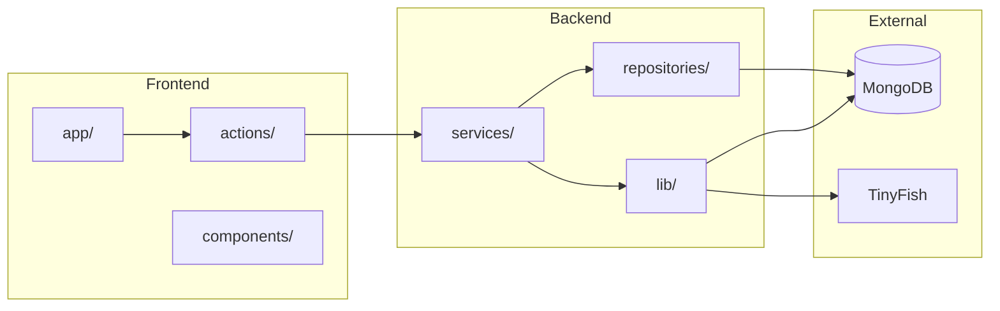

# MarketLens

**AI-powered product intelligence for B2B SaaS.**

<!-- Badges: add build status, license, version when applicable -->
<!-- [](...) [](...) -->

---

## Introduction / Value Proposition

- MarketLens helps **Product Managers and CPOs** at B2B SaaS companies stay ahead of market moves.
- Monitors competitor sites, product matchups, and regulatory sources.
- Runs on-demand AI scans and turns raw changes into prioritized signals and insights.
- Optional automations send new changes or scan results to Slack, n8n, or any webhook.
- **Why it exists:** Teams lose time manually checking competitor pricing, jobs, and compliance pages—and miss important shifts; MarketLens centralizes monitoring, detects changes via AI, and surfaces what matters so you can act quickly.
- _Value proposition:_ MarketLens doesn’t just tell you what’s happening in your market—it helps you create the right work items and track whether your response actually worked.
- **Target audience:** Product Managers, CPOs, and strategy leads at B2B SaaS companies.

---

## Features

- **Competitor Radar**
  - Monitor pricing, job postings, changelogs, features, and reviews.
  - Run on-demand scans.
  - View changes and AI-generated insights by channel.
- **Product Matchups**
  - Define product-vs-competitor matchups with goals.
  - Run scans per matchup.
  - See scoped signals and insights.
- **Compliance Radar**
  - Add regulatory sources (e.g. BSE/NSE).
  - Run compliance scans.
  - View circulars and summaries in the dashboard.
- **Insights & Information**
  - Trend charts; signal breakdown by channel, type, and priority.
  - Top competitors and matchup charts.
  - Workspace overview and matchup summaries.
- **Integrations (Flows)**
  - Visual automation: trigger on new changes, insights, or scan completion.
  - Actions include Slack and webhooks.
  - Manual-first scans; automation opt-in.

---

## Quick Start Guide

### Prerequisites

- **Node.js** 18+
- **MongoDB** (local or [MongoDB Atlas](https://www.mongodb.com/atlas))
- **TinyFish API key** (for scans)
- Optional: **Redis** (for future rate limiting / caching)

### Install

```bash
git clone <repository-url>
cd MarketLens
npm install
```

### Environment Variables

```bash
cp .env.example .env
```

- Edit `.env` with the values below:

| Variable                 | Required         | Description                                                  |
| ------------------------ | ---------------- | ------------------------------------------------------------ |
| `MONGODB_URI`            | Yes              | MongoDB connection string including database name            |
| `JWT_ACCESS_SECRET`      | Yes (production) | Min 32 characters; access token signing                      |
| `JWT_REFRESH_SECRET`     | Yes (production) | Min 32 characters; refresh token signing                     |
| `TINYFISH_API_KEY`       | For scans        | TinyFish API key for Competitor / Compliance / Matchup scans |
| `REDIS_URL`              | Optional         | e.g. `redis://localhost:6379`                                |
| `JWT_ACCESS_EXPIRES_IN`  | Optional         | Default `15m`                                                |
| `JWT_REFRESH_EXPIRES_IN` | Optional         | Default `7d`                                                 |

- Generate JWT secrets: `openssl rand -hex 32` (run twice for access and refresh).

### Run

```bash
npm run dev
```

- Open [http://localhost:3000](http://localhost:3000).
- Sign up to create a company and user, then use the dashboard.

---

## Tech Stack

- **Runtime & framework:** Next.js 15 (App Router), React 19, TypeScript.
- **Data:** MongoDB, Mongoose.
- **Validation & state:** Zod, TanStack Query, Zustand.
- **Auth:** JWT (httpOnly cookies), bcrypt.
- **UI:** Tailwind CSS, Framer Motion, Chart.js, React Flow.
- **Scanning:** TinyFish.

---

## Architecture Overview

### Frontend

- Next.js 15 App Router and React 19.
- Public routes: `/`, `/login`, `/signup`; protected `/dashboard/*` with shared layout and sidebar.
- Server Components fetch via Server Actions that call `getServerAuthContext()` and `server/services/` (often behind `unstable_cache`).
- Client components use `fetch()` to `/api/v1/` or Server Actions for live data (e.g. scan streams, Integrations page).
- State: Zustand for auth and scan progress; TanStack Query for server-backed list/detail (`staleTime` / `gcTime`).
- UI: `components/ui/` (Aceternity, primitives, shadcn), `components/features/<name>/`, `components/common/`.
- Client and shared code do not import from `server/`.
- Path aliases: `@/*` → `src/*`, `@/server/*` → `src/server/*`.

### Backend

- Route Handlers under `app/api/v1/`; each wrapped with `withApiHandler()` (error handling, logging).
- Protected routes use `authenticate` middleware: JWT from cookie or `Authorization` header; sets `x-user-id`, `x-user-role`, `x-company-id`; handlers never read `companyId` from body.
- Business logic in `server/services/`; data access in `server/repositories/` (Mongoose); models in `server/models/`.
- Scan flow: trigger → ScanRun created → TinyFish goals (pricing, jobs, reviews, changelog, features, compliance, matchup) → change detection and enrichment → Change/Insight stored → flows (Slack, webhooks) executed → cache tags revalidated.

### Caching strategies

- **Server-side (Next.js):**
  - **Reads:** `unstable_cache()` in Server Actions (status, insights, information, competitors, compliance sources/schedules/recent runs) and in GET route handlers (flows, competitors, compliance/sources, product-matchups).
  - Revalidate: 2 minutes; cache keys include tags (`status`, `insights`, `information`, `competitors`, `flows`, `compliance-sources`, `product-matchups`) and identifiers (`companyId`, `list`, `page`, `limit`).
  - **Invalidation:** On mutations, `revalidateTag(<tag>)` is called so the next read gets fresh data.
  - Examples: scan completion → `status`, `insights`, `information`; competitor CRUD → `competitors`; flow CRUD → `flows`; compliance source add/delete → `COMPLIANCE_TAG`, `compliance-sources`; product matchup create → `product-matchups`.
- **Client-side:**
  - TanStack Query in feature components (e.g. CompetitorManageView, ComplianceManageView, product-matchups page).
  - `staleTime` and `gcTime` (e.g. 2 minutes) for list/detail data from API or actions.
- **Redis:** Optional; reserved for future rate limiting and app-level cache; not used for cache in current implementation.

### Multitenancy

- Every tenant is a **Company**; users belong to a company via `companyId`.
- All data (competitors, flows, scan runs, changes, compliance sources, product matchups, etc.) is scoped by `companyId`.
- **Source of tenant:** `companyId` only from authenticated session—never from request body or client params.
  - Route Handlers: set by `authenticate` middleware from JWT payload (`x-company-id`).
  - Server Actions: from `getServerAuthContext()` (reads cookies, validates JWT).
- **Repositories:** Every query uses `companyId` as the first filter; create/update/delete receive `companyId` from the service (from auth).
- **Isolation:** No API or action returns another company’s data; cross-tenant access is prevented by design.

### Authentication and authorization

- **Tokens:** JWT access token (default 15m) and refresh token (default 7d); httpOnly cookies where possible; access token can be `Authorization: Bearer <token>`; payload: `sub`, `companyId`, `role`.
- **Login:** Email + password via `auth.service.login()`; bcrypt for verification; access and refresh tokens signed; refresh token stored on user for logout invalidation.
- **Refresh:** `/api/v1/auth/refresh` accepts refresh token from cookie; validates and issues new access token; user must be active.
- **Logout:** Refresh token cleared on user record.
- **Route protection (Edge):** `middleware.ts` on `/api/*` and `/dashboard/*`.
  - Public: `/api/v1/auth/*`, `/api/health`, `/api/v1/webhooks/*`.
  - Other `/api`: 401 if no access token.
  - `/dashboard`: redirect to `/login` with `redirect` query param if no token.
- **API protection:** Protected handlers use `authenticate` middleware; verifies token and sets `x-user-id`, `x-user-role`, `x-company-id`. Optional `authorize(...roles)` for role restriction (403 if not allowed).
- **Server Actions:** `getServerAuthContext()` returns `userId`, `companyId`, `role`; throws if not authenticated.

### Validation

- **Environment:** Zod in `config/env.ts` at startup (`envSchema.parse(...)`); required fields (e.g. `MONGODB_URI`), optional with defaults (e.g. `NODE_ENV`), optional overrides (e.g. `JWT_ACCESS_EXPIRES_IN`); app imports `env` from `config/env`, not `process.env`.
- **API request bodies:** Route Handlers use Zod schemas and `safeParse()`; invalid → 422 and structured error; params (e.g. MongoDB ids) validated before use (objectId regex or Zod).
- **Server Actions:** Validate inputs (required fields, trim); return `ActionResponse<T>` with `success`, `data`, `error`, optional `fieldErrors`; validation errors as `{ success: false, error: "..." }`; services may throw `HttpError` (e.g. `NotFoundError`, `ValidationError`) for business rules.
- **Types:** Shared Zod schemas and types in `types/` and feature modules; `ActionResponse<T>` used across all Server Actions.

### Code structure



---

## API / Database Schema

- **API (REST, `/api/v1/`):**
  - Auth: login, refresh, logout, signup.
  - Users: CRUD.
  - Competitors: CRUD.
  - Flows: CRUD.
  - Scan: `POST /scan/run`, `POST /scan/run/stream` (SSE).
  - Product matchups: list/create; `POST .../scan/stream` (SSE).
  - Compliance: GET sources.
  - Information: GET competitors summary.
  - Insights: GET summary.
  - Webhooks: Stripe.
- **Database (MongoDB + Mongoose):**
  - Models: Company, User, Competitor, CompetitorPage, ScanRun, Change, Insight, ActionItem, ComplianceAlert, ComplianceSource, ComplianceSchedule, ProductMatchup, Flow, CompanyProduct.
  - All tenant-scoped by `companyId`.

---

## License

Private. All rights reserved.
